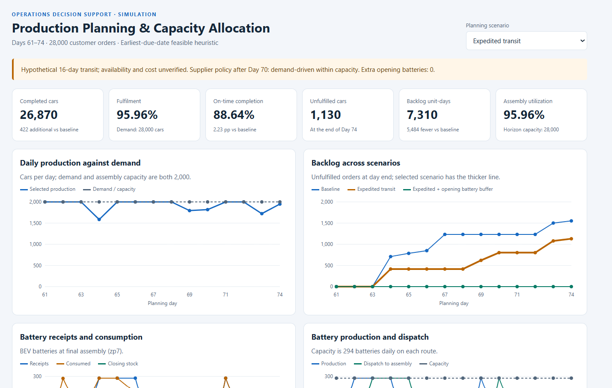
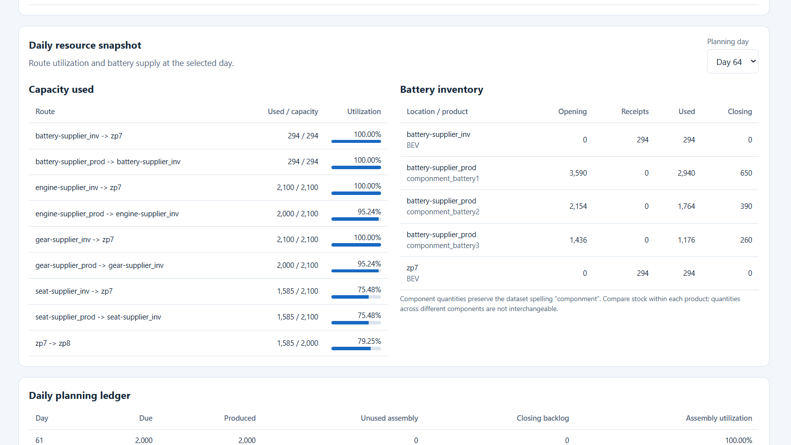

# Automotive Production Planning & Capacity Allocation

A Python and SQLite planning system that simulates **28,000 vehicle orders over 14 days**, identifies material shortages, and compares supply interventions through an **offline interactive dashboard**.

**Method:** deterministic earliest-due-date feasible heuristic. The implementation does not contain a mathematical optimization model or a cost optimizer.

**[▶ Open Interactive Dashboard](https://ranjithsaravanan03.github.io/automotive-production-planning/)**



## Business problem

A production line can assemble 2,000 cars daily, matching daily demand. However, components must arrive through a supplier network with limited production and transport capacity. This project asks whether available materials can support the due orders, why assembly capacity goes unused, and how hypothetical supply changes affect fulfilment.

The audited horizon is **Days 61–74**, representing two planning weeks. This version supports this fixed research case; it is not yet a general-purpose weekly planner.

## Results

All results below are simulated under explicitly documented assumptions.

| Metric | Baseline | Expedited component transit | Expedited + extra opening batteries |
|---|---:|---:|---:|
| Component transit | 20 days | 16 days | 16 days |
| Extra finished batteries before Day 61 | 0 | 0 | 1,130 |
| Demand | 28,000 | 28,000 | 28,000 |
| Completed cars | 26,448 | 26,870 | 28,000 |
| Unfulfilled cars | 1,552 | 1,130 | 0 |
| On-time cars | 24,194 | 24,819 | 28,000 |
| Late completed cars | 2,254 | 2,051 | 0 |
| On-time completion | 86.41% | 88.64% | 100.00% |
| Backlog unit-days | 12,794 | 7,310 | 0 |
| In-horizon feasibility checks | PASS | PASS | PASS |

Reducing component transit from 20 to 16 days yields **422 more completed cars**, **625 more on-time completions**, and **5,484 fewer backlog unit-days**. The on-time improvement is **2.23 percentage points**.

The expedited scenario requires 3,003 BEV batteries but has only 1,873 usable within the horizon. It consumes all of them. The **1,130-battery quantity shortfall explains the remaining 1,130 unfulfilled cars**. An optimistic material quantity bound permits at most 26,870 completed cars under those supply assumptions, and the heuristic attains that bound. This establishes maximum horizon volume under that bound, not optimal on-time completion, backlog-days or cost.

Adding 1,130 hypothetical finished batteries at assembly before Day 61 produces full on-time fulfilment with unchanged in-horizon capacity. That result holds under both tested supplier production policies after Day 70. Procurement availability, pre-horizon production and transport, carrying cost and the expedited service's commercial feasibility are **not established**.

## Dashboard

Open **`docs/index.html`** directly in a browser. It embeds the exported data and works offline without a server or extra packages.

Features:

- Scenario selector and six performance KPIs.
- Daily production versus demand and assembly capacity.
- Backlog comparison across all three displayed scenarios.
- Battery receipts, consumption and closing inventory.
- Battery production and dispatch against route capacity.
- Day selector for route utilization and battery inventory.
- Scenario comparison and daily planning ledger.

The dashboard is a saved-results viewer. Changing its selectors does not rerun the simulation or change operating policies.



For hosting instructions, see [GitHub publishing guide](docs/github_publish.md). The public dashboard is available only after GitHub Pages is enabled and its deployment succeeds.

## Run on Windows

Python **3.10 or newer**. The preparation, simulation, scenario, diagnostic and dashboard scripts use the Python standard library. Re-extracting the binary workbook is optional and has separate dependencies.

From the repository root—the folder containing `src`, `config`, `data` and `reports`:

```powershell
python -m venv .venv
.\.venv\Scripts\python.exe -m unittest discover -s tests -v
```

Source CSVs and the prepared SQLite database are included. To rebuild the data foundation from the included source CSVs:

```powershell
.\.venv\Scripts\python.exe .\src\prepare_data.py
```

Reproduce the main analysis in this order:

```powershell
.\.venv\Scripts\python.exe .\src\baseline_14day.py
.\.venv\Scripts\python.exe .\src\run_expedited_scenario.py
.\.venv\Scripts\python.exe .\src\run_schedule_sensitivity.py
.\.venv\Scripts\python.exe .\src\diagnose_expedited_backlog.py
.\.venv\Scripts\python.exe .\src\run_battery_buffer_sensitivity.py
.\.venv\Scripts\python.exe .\src\verify_buffer_supplier_policy.py
.\.venv\Scripts\python.exe .\src\prepare_dashboard_data.py
.\.venv\Scripts\python.exe .\src\build_planning_dashboard.py
Start-Process .\reports\dashboard\index.html
```

After rebuilding the dashboard, refresh its published copy:

```powershell
Copy-Item .\reports\dashboard\index.html .\docs\index.html -Force
```

Then commit and push the updated `docs/index.html`. GitHub Pages serves this snapshot; it does not run Python.

## Planning rules

- Receive arrivals before the day's allocations; arrival = departure day + route lead time.
- Follow fixed recorded engine/gear supplier production during Days 61–70.
- Use demand-driven production within capacity after Day 70 by default; also test no unscheduled production.
- Process due and backlogged cars in earliest-due-date order, breaking ties by order product ID.
- Skip temporarily infeasible orders and carry them forward. Do not build cars early.
- Respect physical BOM requirements, stock availability, inventory limits, route capacity and lead times.
- Produce and transfer seats just in time.
- Treat missing opening inventory as zero.
- Allow external inputs on demand only at listed engine/gear source-product pairs.
- Preserve existing upstream shipments; tested interventions add no new upstream departures.
- Use greedy horizon-net replenishment; this is not a time-phased MRP optimizer.

The dataset spelling **`componment`** is preserved in component identifiers.

## Files

| Location | Purpose |
|---|---|
| `config/baseline_policy.json` | Explicit simulation policies |
| `data/raw/` | Original research workbook |
| `data/source/` | Worksheet CSV exports |
| `data/processed/planning.sqlite` | Prepared relational database |
| `data/dashboard/` | Consolidated dashboard facts and scenario labels |
| `src/` | Preparation, simulation, scenarios, diagnosis and dashboard scripts |
| `reports/` | Saved summaries, order outcomes, capacity/inventory ledgers and checks |
| `docs/index.html` | Publishable interactive dashboard |
| `docs/assets/` | Screenshots verified on Windows |
| `docs/methodology.md` | Current assumptions, checks and causal findings |
| `docs/recommendations.md` | Findings and practical decision requirements |
| `docs/portfolio_notes.md` | Resume bullets and interview explanation |
| `tests/` | Data-foundation tests; simulation checks are embedded in the engine |

`docs/project_framework.md`, `docs/model_rules.md` and `docs/history/starter-readme.md` retain starter-phase context. The root README and `docs/methodology.md` describe the current implementation.

## Validation and limits

Data checks cover types, keys, references, capacity coverage and exact demand/BOM conservation. The simulation checks nonnegative inventories, stock roll-forwards and event replay, recorded inventory limits, production/transport capacity, flow timing, fixed schedules and order reconciliation. Scenario scripts close SQLite connections explicitly and operate on temporary database copies.

Checks passing means the simulated plan respects the implemented assumptions. It does not validate procurement, actual transport services, uncertain demand, real factory outcomes or profitability. Forecasting, stochastic safety stock, outsourcing, overtime, financial optimization and generalized horizon support are future extensions.

## Data attribution

Andre Moetz, Mathias Quetschlich and Boris Otto (2020), *Data for: Optimisation model for multi-item multi-echelon supply chains with nested multi-level products*, Mendeley Data, Version 1.

- Dataset: https://data.mendeley.com/datasets/pr3sdy5vp3/1
- DOI: https://doi.org/10.17632/pr3sdy5vp3.1
- Dataset license: [CC BY 4.0](https://creativecommons.org/licenses/by/4.0/).
- Transformation details: [sources and attribution](docs/sources.md).

The workbook is preserved; extraction, label normalization, derived tables, project policies, simulations and dashboards are documented independent additions. This is a learning implementation, with no company or dataset-author endorsement. Source dataset licensing does not automatically grant a separate software license to the original project code.
